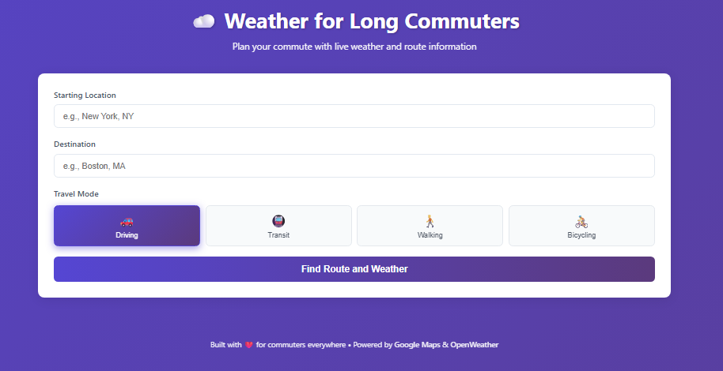

# 🌤️ Commuter Weather App

A lightweight Flask app that combines **Google Maps Directions** and **OpenWeather** data to give commuters real-time route and weather information in one place.

---

## 🚀 Features
- Travel time, distance, and route details  
- Supports **Driving, Transit, Walking, Bicycling**  
- Live weather at your destination (temperature, feels-like, humidity, wind)  
- Transit mode shows lines, stops, and number of stops  

---

## 🛠️ Tech Stack
- **Flask (Python)**
- **JavaScript**
- **Google Maps Directions API**
- **OpenWeather API**
- **HTML / CSS**

---
## ▶️ Run Locally

1. Install dependencies:
    ```bash
    pip install flask requests
    ```

2. Add your API keys:
    ```bash
    set GOOGLE_API_KEY="your_key_here"
    set OPENWEATHER_API_KEY="your_key_here"
    ```

3. Start the server:
    ```bash
    python app.py
    ```

## 📸 Screenshot

<p align="center">
  
</p>

## 🎥 Demo

<p align="center">
  
</p>
   

Then open **http://localhost:5000** in your browser.
